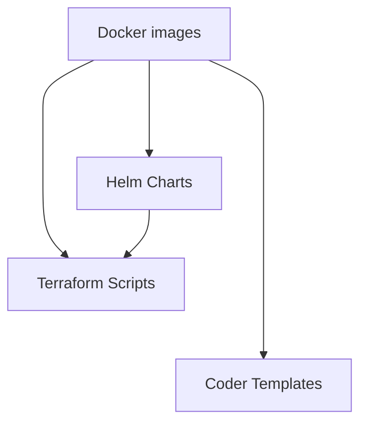

# Kapitan Hull Administrator

## Table of Contents

- [Kapitan Hull Administrator](#kapitan-hull-administrator)
  - [Table of Contents](#table-of-contents)
  - [Preface](#preface)
  - [Usage](#usage)

## Preface

This repository contains Helm charts and Docker builds for global 
components of AI Singapore's end-to-end ML projects.

This repository is to setup the following by the MLOps team within the 
K8S clusters created by the DataOps and InfraOps teams:

- MLFlow
- VSCode

This has to be installed after the cluster is set up with its 
persistence storage and an orchestrator of choice (RunAI, etc.). 

## Usage

The dependency flow is as follows:

- Active developments are on:
  + Code Server and MLFlow Docker builds
  + MLFlow Helm charts
  + Terraform scripts:
    + Spinning up on on-prem and GCP environments
    + Spinning up Coder and MLFlow Helm charts and its dependencies
  + Coder templates to spin up Code Server workspaces

### Docker

> To be added...

### Helm Charts

> To be added...

### Terraform

> To be added...

### Coder Templates

> To be added...
