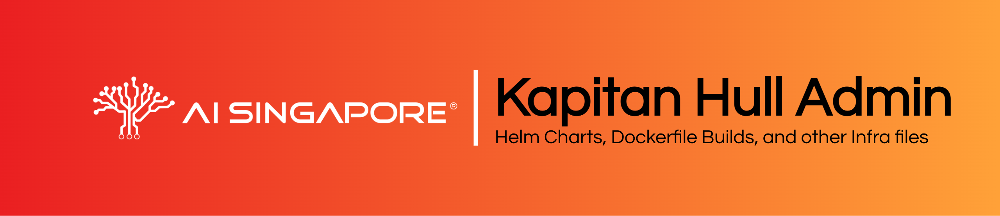

# Kapitan Hull Administrator

## Table of Contents

- [Kapitan Hull Administrator](#kapitan-hull-administrator)
  - [Table of Contents](#table-of-contents)
  - [Preface](#preface)
  - [Usage](#usage)

## Preface

This repository contains Helm charts and Docker builds for global 
components of AI Singapore's end-to-end ML projects.

This repository is to setup the following by the MLOps team within the 
K8S clusters created by the DataOps and InfraOps teams:

- MLFlow
- VSCode

This has to be installed after the cluster is set up with its 
persistence storage and an orchestrator of choice (RunAI, Polyaxon, 
etc.). 

## Usage

> To be added...